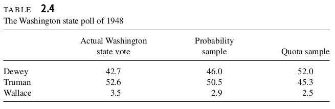
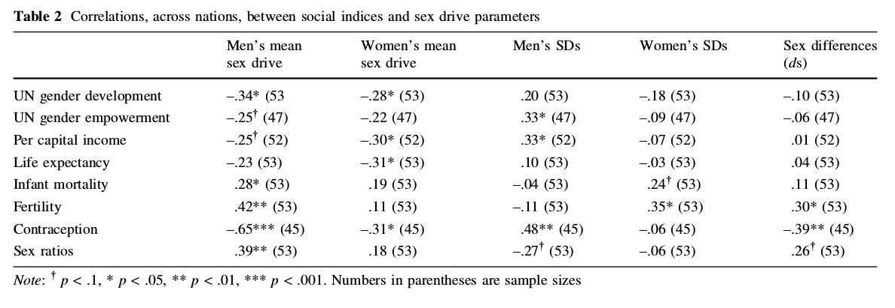

```{r setup, include=FALSE}
knitr::opts_chunk$set(echo = TRUE)
knitr::opts_chunk$set(fig.path="assets/img/lippa/")
setwd("~/hanbin973.github.io/")
```

## 노르웨이 공영방송 NRK 다큐

노르웨이 공영방송 NRK에서는 성차의 생물학적 기반에 관련된 내용을 보도하였습니다.
그러나 방송에서 인용된 연구는 다양한 과학적/통계적 문제점을 갖고 있습니다.
진화심리학 일반에 대한 비판은 페이지의 다른 글들을 참고하여 주십시오. 링크: [모 의대생의 끔찍한 혼종](https://www.facebook.com/pages/category/Science--Technology---Engineering/%EB%AA%A8-%EC%9D%98%EB%8C%80%EC%83%9D%EC%9D%98-%EB%81%94%EC%B0%8D%ED%95%9C-%ED%98%BC%EC%A2%85-303765500025354/)

이 글에서는 방송에서 소개한 연구를 중심으로 진화심리학의 문제점에 대해 알아보도록 하겠습니다.

```{r pressure, echo=FALSE, fig.cap="방송에서 소개한 @Lippa2007", out.width = '100%', fig.align='center'}
knitr::include_graphics("assets/img/lippa/lippa1.png")
```

## 데이터의 출처
연구는 인터넷 상에서 진행된 인터넷 서베이로 총 255,114명의 연구 샘플을 추출했다고 밝혔습니다:

> From February through May 2005, the British Broadcast-
ing Corporation (BBC) conducted an English-language
Internet survey, which focused on human sex differences in cognition, motivation, personality, and sexuality. The survey, designed to produce data for use in the BBC docu-
mentary Secrets of the Sexes, was advertised on the BBC
website and participants responded online.

당연하게도, 인터넷 설문조사는 과학적으로 신뢰하기 어려운 데이터 소스입니다.
친근한 예시를 들면, 이러한 설문조사는 여론조사에 사용되는 *무작위 추출*보다 신뢰도가 떨어지는 데이터입니다.
이러한 방식을 *비확률추출 (Nonprobability Sampling)*이라고 부르며 과학 연구에서는 오래 전에 폐기된 방법입니다.
학부 2학년 조사방법론에서 다루는 교과서인 *Elementary Survey Sampling 7th* [@9780840053619]에서는 1948년 미국의 선거 여론조사를 사례로 하여 유의추출의 위험성을 보여줍니다.

```{r, echo=FALSE, fig.cap="비확률 추출의 사례. [@9780840053619]의 p.15에서 발췌", out.width = '100%', fig.align='center'}

```


Quota Sampling (비확률 추출의 일종)은 무작위 확률 추출(Probability Sample)과 비교했을 때 상당한 오차를 보여줍니다.
실제로 선거 결과를 완전히 반대로 예측한 것을 볼 수 있습니다.

따라서 이 연구의 결론은 잘해야 빈약한 가설에 불과하다는 것을 알 수 있습니다.
혹자는 데이터 수집이 어렵기 때문에 불가피한 연구였다고 주장하나 이는 틀린 주장입니다.
2010년 초중반을 기점으로 [UK Biobank](https://www.nature.com/collections/bpthhnywqk)와 같은 양질의 공개데이터 (샘플수 500,000 이상)가 등장하고 있으며 이를 통한 성적 형질(Sexual Trait)에 대한 연구도 굉장히 활발하게 이뤄지고 있습니다.
그러나 그러한 연구들에서 가십거리로 소비되는 통속적인 결론이 도출되는 것은 확인할 수가 없습니다.
따라서 지나친 PC(Political Correctness)가 연구를 방해하고 있다와 같은 주장들은 비전문가에 의해 생산된 유언비어임을 알 수 있습니다.

예시로 @Day2016 나 @Gill2017 등이 있습니다 (하단의 참고문헌에 링크).

데이터의 양 뿐만 아니라 데이터의 질도 굉장히 중요합니다.
그런 점에서 방송의 다음 장면은 통계학을 호도한 잘못된 발언이라는 것을 알 수 있습니다.

```{r, echo=FALSE, fig.cap="데이터의 양만 강조하는 다큐멘터리의 장면", out.width = '100%', fig.align='center'}

```

## 교란요인(Confounder) 통제
이러한 연구에서는 실험을 통해 비교 대상 간의 특징을 완전하게 맞출 수가 없습니다.
양 쪽의 조건이 일정하지 않을 경우 인과관계와 상관관계를 혼동하는 문제가 발생하는데 이는 1종 오류의 한 가지 사례입니다.

가장 좋은 것은 데이터 추출 단계에서 교란요인을 제거하는 것이지만 이전 단락에서 살펴봤듯이 비확률추출법을 바탕으로 인터넷 설문조사를 이용하는 이 연구는 데이터 추출 단계에서 교란요인을 절대로 제거하지 못합니다.
따라서 분석 단계에서 가능한 교란요인을 통제하는 것이 필수적입니다.

나아가 해당 연구가 국가-간(Cross-National) 비교이기 때문에 더 조심스러울 필요가 있습니다.
연구에서는 기본적인 인구학적 요인(연령, 교육수준, 인종, 가족관계), 국가의 지배적인 종교, UN의 인구개발보고서(Human Development Reports)를 조사하였습니다.
첨언하면, 마지막의 보고서는 소위 UNDP 보고서로 최근에 논란이 된 그 보고서 입니다([오세라비 작가의 인터뷰](https://news.joins.com/article/22973456)).
UNDP보고서는 최근에 한국을 10번째로 성평등한 나라라고 명시한 바가 있습니다(2017년 기준).

이를 바탕으로 연구가 통제에 실패한 요인들을 나열하면 다음과 같습니다.

#### 1. UNDP 지표의 적절성
BBC가 영미권 방송인만큼 대부분의 대상자는 영미권에서 추출되었습니다.

>Participants came from countries across the world,
but the largest numbers were from the United Kingdom
(45%), the United States (29%), Canada (5%), and Australia
(4%). Participants from continental Western Europe made
up about 6% of the sample.

  그런데 UNDP에서 고려하는 수치는 모성 사망비(Maternal mortality ratio), 미성년 출산(Adolescent birth rate), 중등교육 이상 이수여부(Population with at least some secondary education) 등으로 저개발국에 초점이 맞춰져 있습니다 ([링크](http://www.hdr.undp.org/en/composite/GII)).
유앤개발기구가 문자 그대로 저개발국 정책에 집중하는 단체임을 고려하면 적절한 지표라고 할 수 있으나 현재의 논의에서는 부적절하다는 것을 확인할 성수 있습니다.


#### 2. 회귀모델의 문제
상관계수 보고나 회귀모델 분석에 있어 상단에 측정한 가능한 교란요인(소득, 교육수준 등)을 고려하지 않고 단순하게 t-검정을 통해 비교하고 있습니다.

<center>


</center>

교육수준, 소득수준 등의 인구학적 요인 등은 분명히 논문의 Method 부분에 모집되었음을 명시하고 있습니다.
그러나 이를 보정하지 않고 통계분석을 시행한 것은 대단히 부적절합니다. 물론 생물학적 요인을 측정함에 있어 인구학적 요인이 보정될 필요가 없다고 주장할 수도 있습니다.
그러나 의학 연구에서 다루는 생물학적 형질(암, 당뇨 등)조차도 분석 시 인구학적 요인을 보정하는 것은 관례화된 일입니다.


## 검정력(Power)과 1종 오류

가설검정에서 참인 명제를 참으로 바르게 판단할 확률을 *검정력 (Power)*이라고 하며 거짓인 명제를 참이라고 판단할 확률을 *1종 오류 (Type 1 Error)*이라고 부릅니다.

1종 오류의 확률은 연구자가 임의로 선택하는 값입니다.
관례적으로 허용하는 1종 오류의 확률은 5%로 *P*-value의 cutoff 기준이 바로 이것입니다.
그러나 이러한 이분법은 아주 조심스럽게 설계된 연구가 아닌 이상 큰 의미를 갖지 않기 때문에 연속적인 지표로 이해하는 것이 좋습니다.

허용된 1종 오류의 기준치(예를 들어, 5%)가 정해지면 검정력은 샘플 사이즈에 대한 함수가 됩니다.
샘플 사이즈가 클수록 검정력은 증가하고 반대로 샘플 사이즈가 감소하면 검정력은 감소합니다.

이 연구는 200,000 여명의 대상자를 포함하므로 상당히 강력한 검정력을 갖췄다고 볼 수 있습니다. 
하단의 시뮬레이션을 통해 이 논문의 검정력이 얼마인지 측정해보겠습니다.
유의수준은 0.05로 택했습니다.
```{r include=FALSE}
library(tidyverse)
library(pwr)
library(scales)
library(reshape2)
```

```{r }
# define function to calc power
r.pwr <- function(N, r, sig.level){
  return(pwr.r.test(N, r, sig.level)$power)
}

# define data
ns <- c(5, 500, 5000, 50000, 500000)
df <- data.frame(N=ns)
df <- df %>% mutate(pwr5 = r.pwr(N, 0.5, 0.05)) %>% mutate(pwr01 = r.pwr(N, 0.1, 0.05)) %>% mutate(pwr05 = r.pwr(N, 0.05, 0.05)) 
df <- melt(df, id="N")

# draw using ggplot
ggplot(data=df, aes(x=N, y=value, color=variable)) + geom_point() + geom_line() + scale_x_continuous(labels=comma, trans='log10') + xlab('Sample Size (N)') + ylab('Power') + labs(color='effect size')

```

그림은 상관계수의 크기가가 각각 0.5(pwr5), 0.1(pwr01), 0.05(pwr05)일 때 샘플 크기(N)에 따른 검정력을 나타낸 것입니다.

그런데 다중비교를 고려해서 유의수준을 더 엄격하게 잡으면 어떻게 될까요? 
다중비교란 복수의 독립적인 통계 검정을 시행할 때 증가하는 1종 오류의 확률을 말합니다.
Table 1에서는 총 28(=8*7/2)개의 검정을 시행하므로 본페로니의 방법으로 보정하면 0.05/28 = 0.001의 유의수준을 적용해야합니다.

```{r }
# define data
ns <- c(5, 500, 5000, 50000, 500000)
df <- data.frame(N=ns)
df <- df %>% mutate(pwr5 = r.pwr(N, 0.5, 0.001)) %>% mutate(pwr01 = r.pwr(N, 0.1, 0.001)) %>% mutate(pwr05 = r.pwr(N, 0.05, 0.001)) 
df <- melt(df, id="N")

# draw using ggplot
ggplot(data=df, aes(x=N, y=value, color=variable)) + geom_point() + geom_line() + scale_x_continuous(labels=comma, trans='log10') + xlab('Sample Size (N)') + ylab('Power') + labs(color='effect size')

```

이 결과에 비추어보면 Table 1에서 통계적 유의성이 다수 보고되는 것은 자연스럽습니다.
나아가 교란에 대한 보정이 없는 통계량이라는 점까지 고려하면 연구가 보고하는 유의성은 실제 상관관계보다는 Inflation일 가능성이 높습니다.
특히 Table 1에서 보고하는 effect size는 그리 크지 않은데 작은 effect size들이 교란에 더 취약하다는 점을 고려하면 크게 신뢰하기 어려운 결과라는 것을 알 수 있습니다.


## 국가별 데이터 병합 관련
Table 2 이후의 내용을 따로 분리한 것은 몇 가지 찜찜한 점이 있었기 때문입니다.
연구 대상자들을 한 꺼번에 분석에 사용한 Table 1과 다르게 Table 2 이후의 분석에서는 대상자들을 국가별로 합쳐서 평균값을 대상으로 분석을 진행합니다.
이는 연구 대상자가 200,000명에서 50명 수준으로 감소하는 결과를 낳습니다.
저는 이 부분은 노골적인 p-hacking(유의성 조작)이라고 생각하는데 이유는 다음과 같습니다.

#### 1. 검정력 손실
기존의 200,000명에서 대상자를 국가별(약 50개 국가)로 합치고 나면 검정력이 크게 손실됩니다.
이는 통계적으로 유의한 보고의 숫자 감소로 이어지기 때문에 결과론적으로 불리한 행위인데 왜 굳이 이렇게 한 것인지 잘 모르겠습니다.
3번에서는 이 행위가 의도적이었을 가능성을 제시할 것입니다.

#### 2. Sample Weight의 문제
국가별로 인구수가 다르고 국가별로 샘플링한 인원수가 다르므로 리처드 리파 교수가 평균으로 합친 국가별 평균값은 서로 동등하게 비교할 수 없습니다. 가상의 선거 예시를 통해 이에 어떤 문제가 있는지 알아보겠습니다.

서울과 대구의 인구는 각각 1000만명, 250만명 수준입니다.
이 때 서울의 민주당 지지율이 70%, 대구의 민주당 지지율이 30%라고 가정하겠습니다.
그러면 서울과 대구의 평균 지지율은 $(70+30)/2=50$% 일까요?
서울이 인구가 많은 만큼 평균값은 70%에 더 가까운 값이 됩니다.
실제로 계산해보면 $(70 \cdot 4+30 \cdot 1)/5 =62$% 라는 것을 알 수 있습니다.

그래서 여론조사나 기타 신뢰할만한 국가 패널 조사 등에서는 각 개인이 가지는 Weight을 고려합니다.
상단의 예시는 서울 시민에게 대구 시민보다 Weight을 4배 준 것입니다. 
그러나 Weight을 정확하게 계산하기 위해서는 무작위 표본 추출이 반드시 이뤄져야합니다.
하지만 이 연구는 인터넷 서베이를 통한 비확률적 추출 방법을 택하므로 근원적으로 Weight을 고려할 수 없는 한계를 가집니다.

따라서 Table 2 이후의 연구 결과는 영미권은 과소 평가되고 비영미권은 과대 평가된 전혀 믿을 수 없는 결과라는 것을 알 수 있습니다.


#### 3. P-hacking의 문제

1번에서 왜 검정렬 손실을 감수해가면서 국가별로 데이터를 합쳐서 평균값을 이용했는지 의문을 제시했습니다.
만약 샘플수 감소로 인한 통계량의 분산 증가보다 국가별로 데이터를 합침으로써 얻는 분산 감소가 더 크다면 더 작은 P-value를 얻을 수 있을 것입니다.

국가별로 샘플을 통합한 이후 평균값만 이용하므로 국가 안에서 발생하는 분산은 모두 소거됩니다.
그런데 대부분의 샘플(83%)에 해당하는 사람들이 특정 국가에 집중되어있고 나머지 국가들은 상대적으로 작은 샘플을 가지므로 국가별 샘플 통합으로 인한 분산 감소폭은 굉장히 커집니다.

또, 대부분의 대상자가 영미권에 집중되어있다는 점은 UNDP 지수와 같이 종속변수로 활용한 변수의 분산이 실제로는 굉장히 작다는 것을 뜻합니다.
그래서 200,000명을 모두 회귀분석에 넣을 경우 종속 변수의 분산 부족으로 인해 통계적으로 유의한 값이 나타나지 않았을 가능성이 크죠. 

이러한 의심을 시뮬레이션을 통해 확인해봤습니다.
간단한 예제를 통해 이런 식의 데이터 병합이 어떻게 p-hacking에 이용될 수 있는지 확인해보겠습니다.

```{r }
# 병합 전 데이터
x.a <- runif(500,2,4) # 평균이 3, 인구수가 500인 집단 A의 독립변수
x.b <- runif(100,1,3) # 평균이 2, 인구수가 100인 집단 B의 독립변수

y.a <- runif(500,2,4) # a의 종속변수
y.b <- runif(100,1,3) # b의 종속변수

x <- c(x.a, x.b)
y <- c(y.a, y.b)

model <- lm(y~x)

# 병합 후 데이터
x.a.m <- mean(x.a)
x.b.m <- sapply(split(x.b, cut_number(x.b,20)),mean)

y.a.m <- mean(y.a)
y.b.m <- sapply(split(y.b, cut_number(y.b,20)),mean)

x.m <- c(x.a.m, x.b.m)
y.m <- c(y.a.m, y.b.m)

model.m <- lm(y.m~x.m)

print(summary(model))
print(summary(model.m))

```

상단의 결과와 하단의 결과를 비교해보면 독립변수의 계수가 증가한 것 뿐만 아니라, 표준오차(Std. Error)역시 감소하였으며 그 결과 t-통계량 역시 5배 이상 증가한 것을 관찰할 수 있습니다.

## 맺음말
맺음말은 추후에 업데이트 하도록 하겠습니다.
작문할 에너지가 없네요 ㅠㅠ


## 참고문헌
